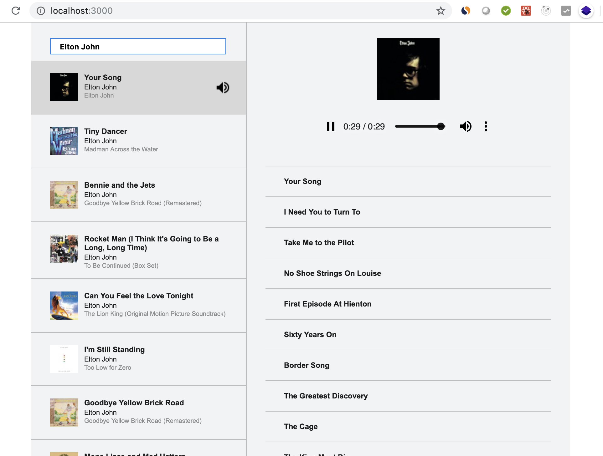

# Music Player Built With React
The music player allows searching for songs by artist on iTunes and playing previews of selected songs. It is built as a simple gadget, but "under the hood" it is set for easy scaling up into a sophisticated application. It is built with React, Redux, Redux Thunk, Axios and custom CSS (the web page is responsive).

Here is a screenshot of the app on a small screen:

  

Here is a screenshot of the app on a desktop screen:

  

## Supported browsers
The app was extensively tested on Google Chrome - Version 73.0.3683.86 (Official Build) (64-bit).

## Supported features
- Search for songs by artist on iTunes (the number of songs returned with each search is arbitrarily set to 10). A search is initiated after at least 3 characters are entered into the search field and is updated with each additional character.
- Search results are presented in the form of a list.
- Each song’s title, artist, album and album art are displayed.
- When a song is selected, it begins to play in a media player. On a small screen the media player pops up at the bottom of the screen. On a larger (desktop) screen it will be shown in the right pane under the album art (large image).
- The right pane also displays a list of other songs of the selected song's album (they are not "clickable").
- Selected song is highlited in the left pane and is marked with a small loudspeaker image.
- A user can perform other searches while the song they selected continues to play.

## Requirements to build the app
- Git needs to be installed on the local computer.
- Node.js and npm need to be installed on the local computer.

## Instructions to build and deploy the app
- Clone the repository (`git clone https://github.com/chepakovich/musicplayer.git`).
- Change the current directory (`cd musicplayer`).
- In the terminal type `npm install` to install dependencies.
- In the terminal type `npm start` to run the app at http://localhost:3000/.
